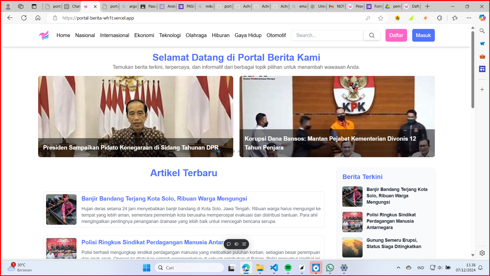
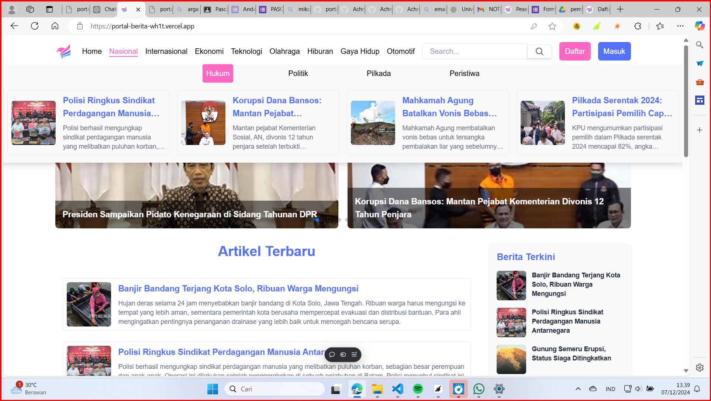
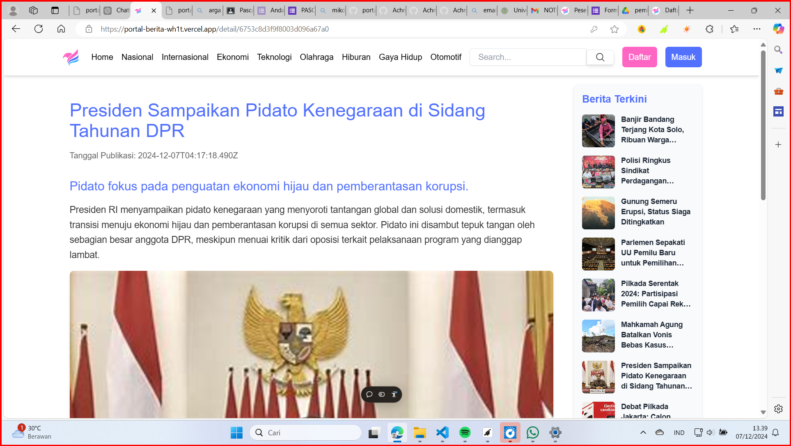
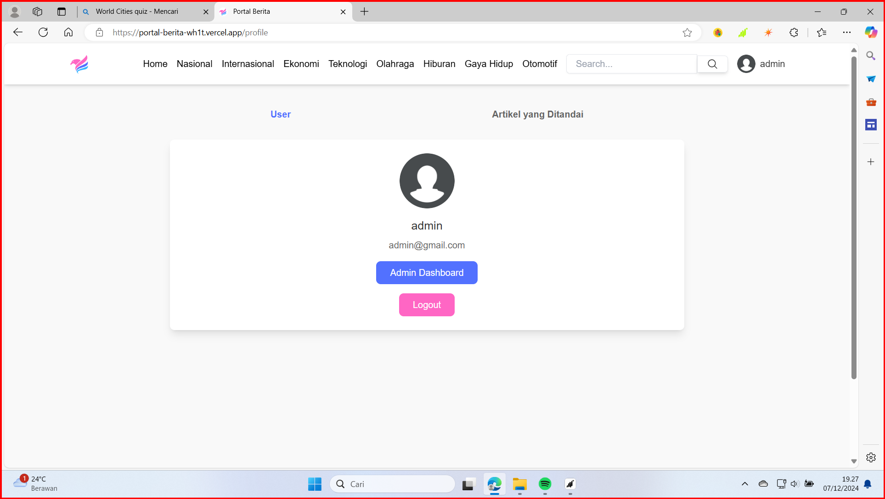
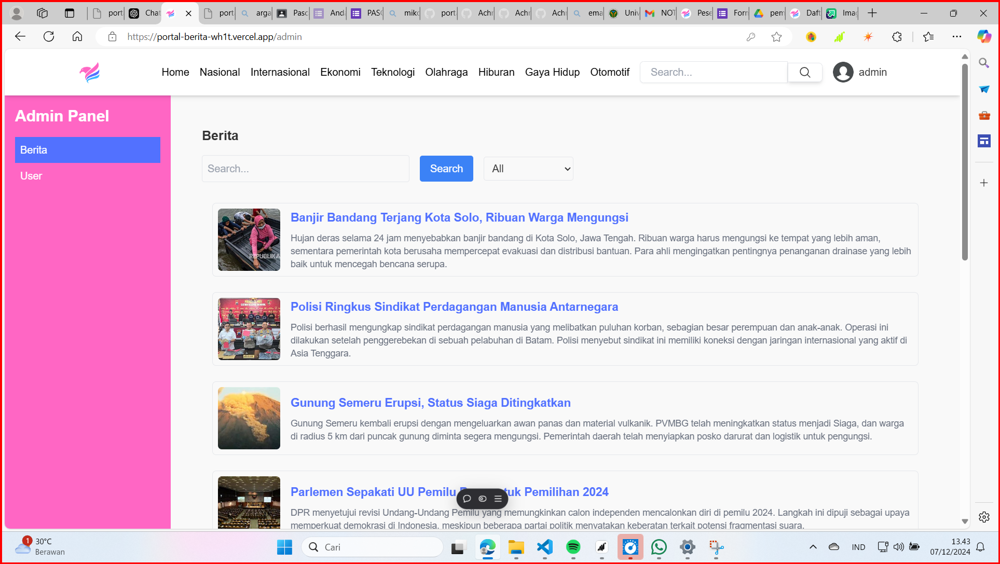
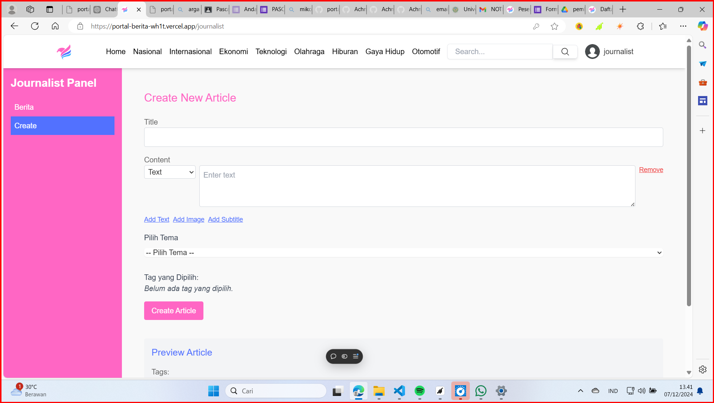
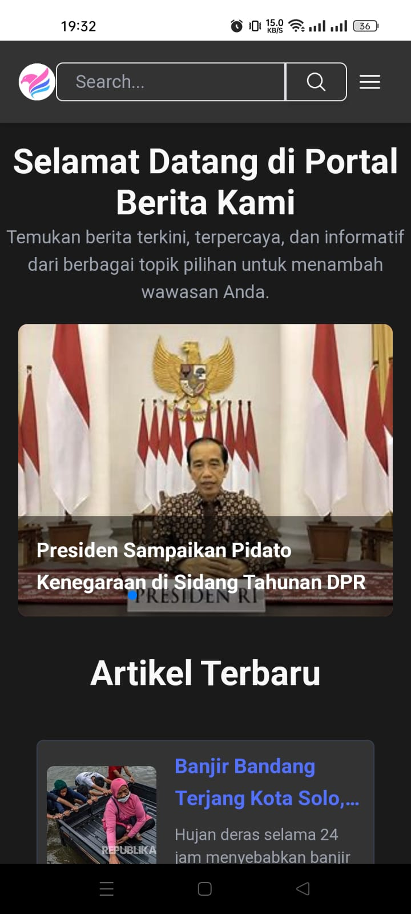

# Portal Berita

Portal Berita is a news portal built using React and Vite. The project is fully responsive and includes features such as dark mode and Progressive Web App (PWA) support.

## Features

- Responsive design
- Dark mode (based on system preference)
- Admin and journalist login
- Dashboard accessible through the profile page
- PWA support

## Installation

1. Clone the repository:

   ```bash
   git clone https://github.com/Achmad-Farid/portal-berita.git
   cd portal-berita
   ```

2. Install dependencies:

   ```bash
   npm install
   ```

3. For backend, clone and run [portal-berita-backend](https://github.com/Achmad-Farid/portal-berita-backend).
4. add .env

5. Start the frontend development server:

   ```bash
   npm run dev
   ```

6. Open your browser at [http://localhost to view the portal berita.

### Preview

You can also view the live preview of the website at [Portal Berita](https://portal-berita-wh1t.vercel.app/).








this web can be downloaded in mobile with PWA


### Admin & Journalist Login

- Admin login:  
  Username: `admin`  
  Password: `123`

- Journalist login:  
  Username: `journalist`  
  Password: `123`

### Dashboard

The dashboard can be accessed via the profile page.

## Technologies Used

- React
- Vite
- Tailwind CSS
- ESLint
- PWA
